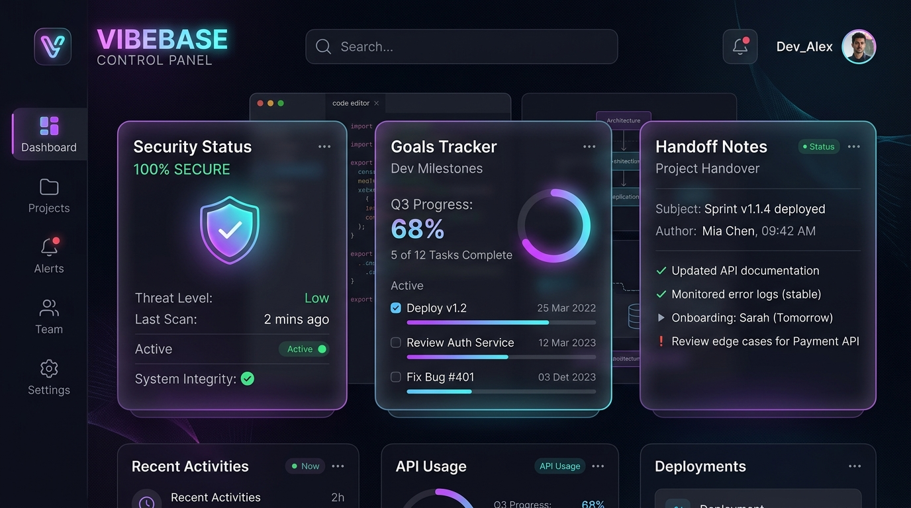

<div align="center">
  <h1>🌊 vibebase</h1>
  <p><strong>The ultimate foundation for Vibe Coding with AI Agents.</strong></p>
  <p>Vibecoder friendly. 100% Local. Zero configuration.</p>
  
  <p>
    <a href="https://www.npmjs.com/package/@agonxl/vibebase"></a>
    <a href="https://github.com/agonxl/vibebase/blob/main/LICENSE"></a>
    
  </p>

  
</div>

---

## 🚀 Quick Start (Zero Configuration)

You don't even need to install anything. Just open your terminal, go to your project folder, and run:

```bash
npx @agonxl/vibebase
```

**That's it. Just one command.** Vibebase is smart enough to know what you want:
- If this is a **new project**, it automatically runs the interactive `init` wizard to set up your AI Agent infrastructure and scaffold your framework (Next.js/Vite).
- If your project is **already initialized**, it automatically launches the beautiful **Web Control Panel (UI)** in your browser!

### What does it do?
It builds a complete **Agentic Workflow Architecture** that stays 100% on your local machine:
1. **\`VIBE.md\` (AI Instructions):** Trains any AI agent on how to interact with your project using strict commands (\`close\`, \`load\`, \`audit\`, \`review\`, \`compress\`).
2. **\`.vibe/\` Folder (The Foundation):**
   - **\`[project-name].md\`**: The Heart of your project. Tracks goals, ideas, and your daily vibe.
   - **\`handoff.md\`**: For agent shift-handovers. AI saves its context here so a new chat session can pick up exactly where it left off.
   - **\`architecture.md\`**: Define your tech stack and coding conventions. The AI will enforce these during code reviews.
3. **AI Rules:** Generates \`.cursorrules\` or \`clauderules.md\` automatically so your AI never forgets the project's vibe.

---

## 🤖 The AI Commands (Prompt Engineering)

Once initialized, you can type these magic words into your AI Chat to trigger powerful, pre-programmed behaviors:

- **\`load\`**: The AI instantly reads \`.vibe/handoff.md\` and picks up exactly where the last chat session left off.
- **\`close\`**: The AI writes a summary to \`.vibe/handoff.md\` for the next session, saves your state, and pushes to git.
- **\`review\`**: The AI acts as a Senior Developer, reading your \`architecture.md\`, and ruthlessly reviews your recent code changes.
- **\`compress\`**: The AI reads your Heart file, archives completed goals, and keeps your project context lightweight and fast.
- **\`audit\`**: The AI scans your codebase for leaked API keys, moves them to \`.env\`, and checks \`.gitignore\`.

---

## 🛠️ CLI Superpowers (Terminal Commands)

Not using an integrated AI editor? No problem. Use our built-in terminal commands:

### 📦 Pack Context for Web AI
```bash
npx @agonxl/vibebase pack
```
*Bundles your entire \`.vibe/\` folder and instructions into one file (\`vibe-context.txt\`). Just copy and paste it directly into ChatGPT or Claude Web!*

### 🛡️ Vibe & Security Check
```bash
npx @agonxl/vibebase check
```
*Scans your project for forgotten API keys and prints a beautiful, colorful progress report of your goals directly to the terminal.*

### 🌐 Web Control Panel (v2.0+)
```bash
npx @agonxl/vibebase ui
```
*Instantly launches a beautiful, dark-mode Glassmorphism Web Dashboard in your browser. It visually tracks your project goals, displays real-time Vibe scores, and monitors your handoff and security status. 100% Local, zero configuration required!*

---

## ❓ Troubleshooting & FAQ

**1. "NPM error: ETARGET / No matching version found"**
If you just published a new version and immediately try to run it via `npx`, NPM's global CDN cache might need a minute to sync. 
**Fix:** Run `npm cache clean --force` or simply wait 60 seconds and run `npx --yes @agonxl/vibebase@latest` again.

**2. The AI says "load [project] not found"**
- If you are using Cursor, ensure you typed the exact project name you entered in the wizard (check the filename inside the `.vibe/` folder, e.g., `.vibe/myproject.md`).
- If you are using ChatGPT Web, Kimi, or Codex, the AI doesn't automatically know our custom commands. **Fix:** Run `npx @agonxl/vibebase pack`, copy the output, and paste it into the AI chat first to teach it the rules!
- If the AI is not reading the rules automatically, just type `@VIBE.md load [project]` to force it to read the instructions.

---

**Keep it simple. Keep the vibe high. ✨**
